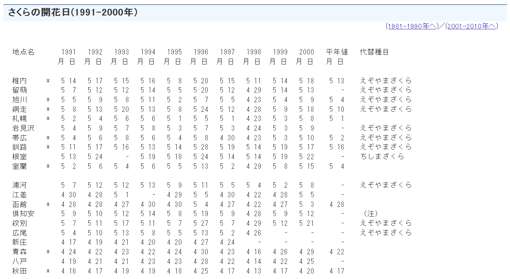

# Japanese-Cherry-Blossom-Predictions-for-2025

! Note : this page will be updated in the spring to compare our forcasts with the blooming dates in 2025 :) 

## Motivation and Background

Cherry blossom trees, or "Sakura" in the Japanese language, are a distinct species of trees that have become a staple for spring all over the world. Every year, the blossoming of new flowers captivates both locals and tourists, and in most places this natural event officially marks the beginning of the spring season. However, planning holidays and trips in order to witness the Japanese unofficial national flower in its full bloom have shown to be quiet a challenging task. Different factors such as regional climate conditions and yearly weather variations, have made it harder to accurately make these predictions. 

This project is going to be an attempt to analyze and model the hidden trends present in historical data about the blooming of Sakura flowers. Our final goal is to provide accurate forecasts for the full blooming of Cherry blossoms in the coming year of 2025. While multiple attempts have been done in the past to achieve this goal, our project offers a unique approach where we gathered datasets from multiple sources, and produced an in-depth analysis that helps understand this natural process and the factors around it in more detail.

## Data collection 

The data collection process relayed heavily on web scrapping techniques, which were used to gather data from the Japan Meteorological Agency website. The picture below shows how the original format of our data looked like on the website.

The original dataset was structured with each row representing a different location, covering a total of 58 cities across Japan. The columns on the other hand indicate the years of observation, with the values representing the peak blooming dates (month and year) for each location. The source website also only displays the data for 10 years at a time, which meant that the collection process needed to be done over multiple web pages to compile a comprehensive dataset. Additionally, the dataset also includes information about whether the location is still currently under observation.
The data processing phase included several steps that allowed us to transform the unstructured output from the JMA website into a structured dataset ready for analysis, key steps included: 

- 	**Turning lines of text into a data frame**
- 	**Standardizing the representation of missing dates to replace the ‘-’ symbol**
- 	**Dropping unnecessary columns**
- 	**Translating the text from Japanese to English**
- 	**Processing special symbols in the data**
- 	**Final reshape of the data**
- 	**Dealing with missing values**
- 	**Data augmentation’**

## Data Analysis

In this section, we tried to dig a bit deeper into the dataset and see what we could find before going into the modeling. For more details, check the  notebook [Data Analysis and Visualization notebook](data analysis and visualization.ipynb) for some cool visualizations and insights 

## Modeling and forecasting

Before we could get into our modeling, a few statistical tests were needed to inspect the characteristics of our data. Since our goal is to predict the future peak blooming dates, which essentially is a time series, understanding the properties and influence of seasonal patterns, and temporal trends in the data was crucial. Mainly we tested for two properties, **seasonality** and **stationarity**.

### Additional feature engineering - Lagged Features

Since we decided to use Machine Learnng regression techniques for our forecasting approach, lagged features are a good addition to our data and are a way to compensate for the possible lost information about the effects of the past observations on the current ones. In other words, we will try and capture the temporal dependencies and use previous years' blooming dates as predictors for future years.
Lagged data is important, but the number to choose is a bit tricky to define. We want to define a few to capture the effect of previous years but at the same time not too many to not risk overfitting. if we go back we can see that the trend for average blooming dates has been drastically changing in the past 10 years so we have to account for that without overfitting our model, we will start with a 3 lagged features (previous 3 year's bloom day) and test our model performance, if needs call for it we will add or reduce the lag variables.

### Model training

As we mentioned earlier, our model choice was based off of the model’s ability to capture and correctly handle our time series properties. With that in mind we choose three common examples of machine learning models used in this scenario, namely two ensemble methods Gradient Boosting Machines (GBM), and Random Forest, as well as a Recurrent Neural Networks variant LSTM (Long Short-Term Memory).
At this point in the analysis, we also chose to train our models on all locations combined (multiple series), we can only hope that the model accurately captures the slight differences between locations, training different models on different locations will be too computationally expensive, and would require much more data. 
It’s important to note as well that our train-test split was done prior to the feature engineering to avoid any possible data leakage. This way, the model only uses information that would have been available at the time of prediction. And as it goes with working with time series our training set consisted of earlier years (data before 2018), while our test set consisted of the years that came after (after 2018).
For model performance, our best model was Random forest with an R^2 value of 0.73, followed by LSTM with an R^2 of 0.71, and with GBM coming last with 0.706.

### Forecasting

In order to get the predicted future values of blooming dates in 2025, we needed a dataset that is similar to our initial dataset used for training the models. Most features were quite easy to obtain with th exception of average temperatures. Since it is not very straight forward to get access to the forecasts of temperatures for 2025 across all locations (especially since the blooming times vary across locations) we instead decided to use the average temperatures across our historical data and use it for our forecasting. 

Results are shown in the [Modeling and Forecasting notebook](modeling and forecasting.ipynb) 

## Conclusion and future notes

In conclusion, our project was overall a success and our models performed very well. We were able to get very interesting insights during our analysis and discovered useful information regarding Japan’s spring symbol. 

For future work, additional efforts can be made in data collection. Augmenting the dataset with years further back can definitely improve our results and understanding. While using Machine Learning models had a good outcome, going back to basics and using traditional time series models such as ARIMA, SARIMA, or Prophet can enable us to further improve our results.

Finally, now that we have the forecast for the year 2025, all we need to do is wait a few months and see if these predictions were close to reality.

